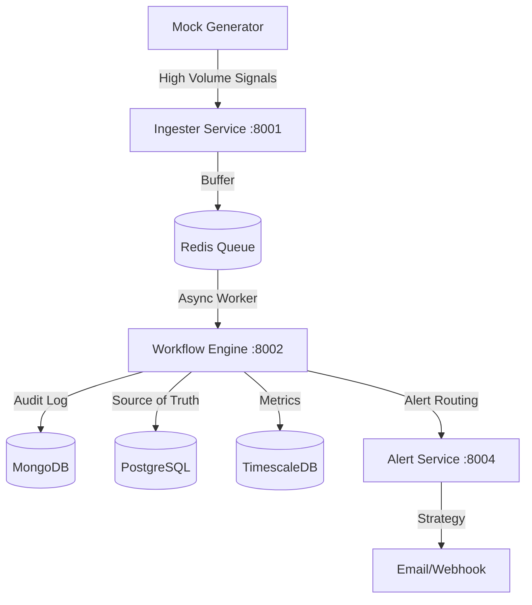

# Incident Management System (IMS)

A resilient, microservice-based Incident Management System designed to handle high-throughput signals (10,000+ signals/sec) with intelligent debouncing, state-driven workflows, and polyglot persistence.

## 🏗️ Architecture Overview



### **Tech Stack & Rationale**
- **Node.js (Fastify)**: High-performance, low-overhead framework for high-throughput ingestion.
- **PostgreSQL**: Source of truth for Work Items and RCA records (Transactional integrity).
- **MongoDB**: Schema-less storage for raw signal audit logs (Scalability).
- **TimescaleDB**: PostgreSQL extension for time-series metrics and throughput aggregations.
- **Redis**: Multi-purpose layer for **BullMQ (Backlog Management)**, **Debouncing**, and **Dashboard Caching**.

---

## 🚀 Getting Started

### **1. Installation**
Install dependencies for all microservices in one command:
```bash
# In the /backend directory
npm run install:all

# In the /frontend directory
npm install
```

### **2. Running the System**
The system is fully containerized for easy deployment.

**Using Docker (Recommended):**
```bash
docker-compose up --build
```
*   **Frontend**: http://localhost:3000
*   **Ingester**: http://localhost:8001
*   **Workflow Engine**: http://localhost:8002
*   **Mock Generator**: http://localhost:8003
*   **Alert Service**: http://localhost:8004

---

## 🎮 Operations & Demos

### **Run Outage Simulation**
Use the interactive CLI tool to trigger multi-stage infrastructure failures:
```bash
cd backend
npm run simulate
```
*Choose scenario `[1]` to simulate an **RDBMS primary failure cascading into MCP processors and API timeouts**.*

### **Run Unit Tests**
Verify the RCA state-machine logic and MTTR calculations:
```bash
cd backend
npm run test
```
*Expected: 8/8 tests passing (includes state validation and mandatory RCA field checks).*

---

## 🛠️ Key Project Scripts (Backend)

| Command | Action |
| :--- | :--- |
| `npm run dev` | Starts all 4 microservices simultaneously (requires concurrently) |
| `npm run simulate` | Launches the interactive Node.js Outage Simulator |
| `npm run test` | Runs the Node.js built-in test runner for the RCA suite |
| `npm run install:all` | Recursive install for Ingester, Workflow, Alert, and Mock services |

---

## 🛡️ Resilience Features
1. **Producer-Consumer Architecture**: Uses BullMQ to buffer spikes in traffic, protecting database nodes from exhaustion.
2. **Intelligent Debouncing**: Prevents alert fatigue by linking high-frequency signals to a single open incident via Redis keys.
3. **State Pattern Lifecycle**: Enforces a strict `OPEN` → `INVESTIGATING` → `RESOLVED` → `CLOSED` workflow.
4. **Strategy Pattern Alerting**: Decouples component types from notification logic, allowing for easy addition of new alert channels (Slack, PagerDuty, etc.).

---

## ⚖️ Evaluation Rubric Alignment
- **Concurrency**: Managed via Redis-backed task queuing and atomic debouncing.
- **Data Integrity**: Transactional RCA submission with mandatory field enforcement.
- **Scalability**: Polyglot storage strategy (SQL for truth, NoSQL for logs, TSDB for metrics).
- **Architecture**: Master-Detail service discovery UI with integrated terminal telemetry.
